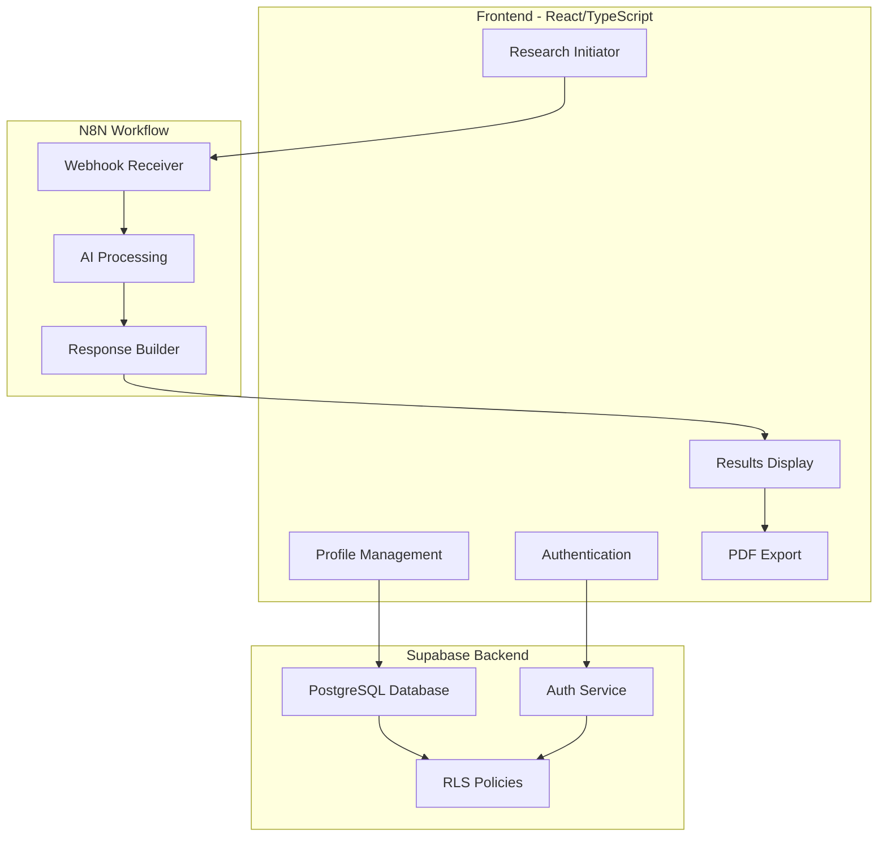
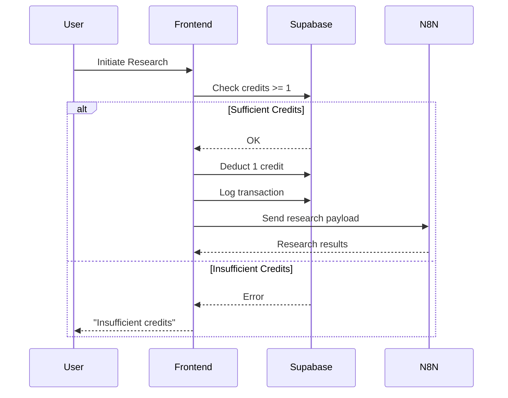
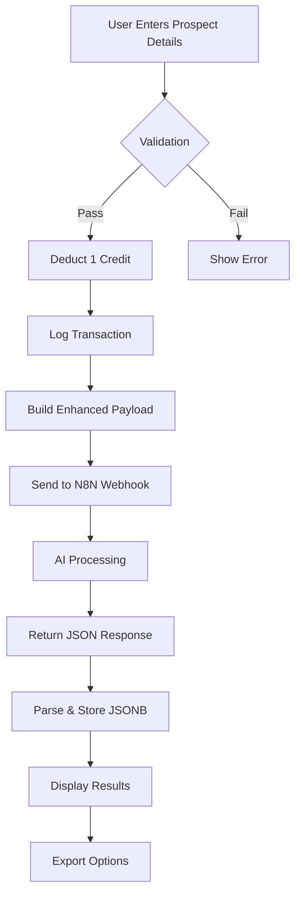
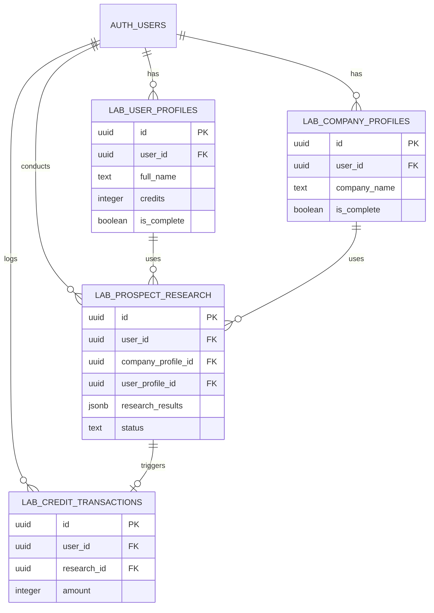

# Research Engine - Product Requirements Document

**Version**: 1.0  
**Last Updated**: 2025-10-03  
**Author**: Magnus Froste

---

## Executive Summary

### Product Vision
Research Engine is an AI-powered prospect analysis platform that transforms how sales and business development professionals research and approach potential clients. By combining intelligent user/company profiling with AI-driven analysis, the system delivers personalized, actionable insights for every prospect.

### Value Proposition
- **Context-Aware Research**: AI analysis informed by your company profile and communication style
- **Actionable Insights**: Structured outputs with fit scores, decision maker analysis, and contact strategies
- **Time Savings**: Minutes instead of hours per prospect research
- **Personalization at Scale**: Maintain quality while increasing prospect volume

### Target Users
- **Primary**: Sales Directors, Business Development Managers, Founders
- **Secondary**: Marketing Directors, Account Executives, Consultants
- **Company Size**: Solo entrepreneurs to medium businesses (1-200 employees)

### Key Differentiators
1. **Dual Profile System**: Both company and user profiles inform every research
2. **Dynamic AI Structure**: Content sections adapt automatically via system prompt
3. **Credit-Based Model**: Clear, predictable pricing (5 free credits to start)
4. **Full Stack Solution**: Auth, database, AI processing, and export in one platform

---

## System Architecture

### High-Level Architecture



### Technology Stack

**Frontend**
- React 18 + TypeScript
- Tailwind CSS with semantic design tokens
- Shadcn/ui component library
- React Router for navigation
- React Hook Form + Zod for validation
- React Markdown for dynamic content rendering

**Backend**
- Supabase (PostgreSQL + Auth + RLS)
- N8N for AI workflow orchestration
- Webhook-based communication

**AI Processing**
- Claude/GPT-4 (configurable in N8N)
- System prompt controls all output structure
- JSONB storage for flexible schema

---

## User Profile System

### Overview
User profiles capture individual preferences, communication style, and outreach approach to personalize AI research outputs.

### Complete Field List (26 fields)

#### Section A: Personal Information (5 fields)
1. **full_name** - `text` (required) - User's full name
2. **linkedin_profile** - `text` (optional) - LinkedIn profile URL
3. **current_location** - `text` (optional) - Current city/location
4. **birthplace** - `text` (optional) - Hometown/birthplace
5. **date_of_birth** - `date` (optional) - Date of birth

#### Section B: Role & Context (3 fields)
6. **role_in_organization** - `text` (required) - Select from:
   - CEO/Founder
   - Sales Director/Manager
   - Business Development Manager
   - Marketing Director/Manager
   - Operations Manager
   - Partner/Co-founder
   - Consultant/Advisor
   - Other

7. **outreach_experience** - `text` (required) - Select from:
   - New (< 1 year)
   - Beginner (1-2 years)
   - Experienced (3-5 years)
   - Expert (5+ years)

8. **prospects_per_week** - `text` (required) - Select from:
   - 1-5
   - 6-15
   - 16-30
   - 30+
   - Variable

#### Section C: Communication Style & Personality (3 fields)
9. **communication_style** - `text` (required) - Select from:
   - Direct & to-the-point (business first)
   - Relational & personal (connection first)
   - Analytical & data-driven (facts first)
   - Inspiring & visionary (possibilities first)
   - Consultative & advisory (questions first)

10. **introduction_style** - `text` (required) - Select from predefined templates

11. **credibility_preference** - `text[]` (required) - Multi-select from:
    - Case studies & concrete examples
    - Methodology & frameworks
    - Team credentials & experience
    - Client testimonials & references
    - Industry awards & recognition
    - Personal expertise & track record

#### Section D: Outreach Preferences (3 fields)
12. **preferred_contact_channel** - `text[]` (required) - Multi-select from:
    - LinkedIn message
    - Email outreach
    - Phone call
    - Referral introduction
    - Social media (Twitter, etc.)
    - Event/networking meeting

13. **followup_timing** - `text` (required) - Select from:
    - Quick & persistent (within 3 days)
    - Moderate & respectful (within 1 week)
    - Patient & strategic (within 2 weeks)
    - Varies per prospect

14. **nonresponse_handling** - `text` (required) - Select from:
    - Multiple follow-ups until clear 'no'
    - 2-3 attempts then move on
    - 1 follow-up then stop
    - Depends on prospect value/fit

#### Section E: Value Proposition & Messaging (3 fields)
15. **pain_points_focus** - `text[]` (required) - Multi-select from:
    - Cost/efficiency issues
    - Growth/scaling challenges
    - Technology/digital gaps
    - Compliance/risk issues
    - Process/operational friction
    - Team/organizational challenges
    - Customer experience problems

16. **expertise_positioning** - `text` (required) - Select from:
    - As industry specialist/expert
    - As problem solver/consultant
    - As strategic partner/advisor
    - As innovative solution provider
    - As results-driven implementer

17. **objection_handling** - `text[]` (required) - Multi-select from:
    - Address upfront in initial message
    - Respond when objections arise
    - Use social proof to preempt
    - Ask questions to understand concerns
    - Provide alternatives/flexibility

#### Section F: Meeting & Conversion (3 fields)
18. **meeting_format** - `text[]` (required) - Multi-select from:
    - Video call (Teams/Zoom)
    - Phone call
    - In-person meeting
    - Coffee meeting (informal)
    - Prospect's office visit
    - Flexible - prospect choice

19. **meeting_duration** - `text` (required) - Select from:
    - 15-30 minutes (quick qualification)
    - 30-45 minutes (standard discovery)
    - 45-60 minutes (deep dive)
    - 60+ minutes (comprehensive)

20. **success_metrics** - `text[]` (required) - Multi-select from:
    - Response rate %
    - Meeting booking rate %
    - Qualified opportunities
    - Conversion to proposal
    - Closed deals
    - All of the above

#### Metadata Fields (6 fields)
21. **credits** - `integer` (default: 5) - Available research credits
22. **is_complete** - `boolean` (default: false) - Profile completion status
23. **created_at** - `timestamp` - Profile creation date
24. **updated_at** - `timestamp` - Last modification date
25. **user_id** - `uuid` (required) - Associated user ID
26. **id** - `uuid` (auto-generated) - Primary key

### Database Table
```sql
CREATE TABLE lab_user_profiles (
  id uuid PRIMARY KEY DEFAULT gen_random_uuid(),
  user_id uuid NOT NULL REFERENCES auth.users,
  full_name text NOT NULL,
  linkedin_profile text,
  current_location text,
  birthplace text,
  date_of_birth date,
  role_in_organization text NOT NULL,
  outreach_experience text NOT NULL,
  prospects_per_week text NOT NULL,
  communication_style text NOT NULL,
  introduction_style text NOT NULL,
  credibility_preference text[] NOT NULL DEFAULT '{}',
  preferred_contact_channel text[] NOT NULL DEFAULT '{}',
  followup_timing text NOT NULL,
  nonresponse_handling text NOT NULL,
  pain_points_focus text[] NOT NULL DEFAULT '{}',
  expertise_positioning text NOT NULL,
  objection_handling text[] NOT NULL DEFAULT '{}',
  meeting_format text[] NOT NULL DEFAULT '{}',
  meeting_duration text NOT NULL,
  success_metrics text[] NOT NULL DEFAULT '{}',
  credits integer NOT NULL DEFAULT 5,
  is_complete boolean DEFAULT false,
  created_at timestamp with time zone NOT NULL DEFAULT now(),
  updated_at timestamp with time zone NOT NULL DEFAULT now()
);
```

---

## Company Profile System

### Overview
Company profiles capture business details, offerings, and differentiators to provide context for AI-powered prospect analysis.

### Complete Field List (28 fields)

#### Basic Information (8 fields)
1. **company_name** - `text` (required) - Company name
2. **website_url** - `text` (required) - Company website URL
3. **linkedin_url** - `text` (optional) - Company LinkedIn URL
4. **business_registration** - `text` (optional) - Business registration details
5. **industry** - `text` (required) - Industry classification
6. **years_active** - `text` (optional) - Years in business
7. **company_size** - `text` (required) - Select from:
   - Solo (1 person)
   - Startup (2-10 people)
   - Small Business (11-50 people)
   - Medium Business (51-200 people)
   - Large Business (201-1000 people)
   - Enterprise (1000+ people)

8. **geographic_markets** - `text[]` (required, default: []) - Multi-select from:
   - Local/Regional
   - National
   - International
   - Global

#### Mission & Vision (2 fields)
9. **mission** - `text` (required) - Mission statement
10. **vision** - `text` (optional) - Vision statement

#### Values & Culture (2 fields)
11. **values** - `text[]` (required, default: []) - Multi-select from:
    - Innovation, Quality, Customer Service, Sustainability, Transparency, Collaboration, Excellence, Integrity, Growth, Community Impact

12. **organizational_personality** - `text[]` (required, default: []) - Multi-select from:
    - Remote-First, Hybrid, In-Person, Flexible Hours, Results-Oriented, Collaborative, Fast-Paced, Innovation-Focused

#### Offerings & Services (13 fields)
13. **offering_type** - `text[]` (required, default: []) - Multi-select from:
    - Products, Services, Software, Consulting, E-commerce, SaaS, Hardware, Content

14. **main_offerings** - `text[]` (required, default: []) - Primary products/services
15. **target_industries** - `text[]` (required, default: []) - Target industries
16. **ideal_client_size** - `text[]` (required, default: []) - Preferred client sizes
17. **project_scope** - `text` (required) - Typical project scope
18. **unique_differentiators** - `text[]` (required, default: []) - Unique selling propositions
19. **credentials** - `text[]` (required, default: []) - Professional credentials
20. **typical_results** - `text[]` (required, default: []) - Common outcomes delivered
21. **known_clients** - `boolean` (optional, default: false) - Has notable clients
22. **known_clients_list** - `text` (optional) - List of notable clients
23. **success_story** - `text` (optional) - Detailed success story
24. **delivery_model** - `text[]` (required, default: []) - Service delivery methods
25. **pricing_positioning** - `text` (required) - Pricing strategy
26. **communication_style** - `text` (required) - Preferred communication tone

#### Metadata Fields (2 fields)
27. **is_complete** - `boolean` (default: false) - Profile completion status
28. **user_id** - `uuid` (required) - Associated user ID

Plus automatic: `id`, `created_at`, `updated_at`

### Database Table
```sql
CREATE TABLE lab_company_profiles (
  id uuid PRIMARY KEY DEFAULT gen_random_uuid(),
  user_id uuid NOT NULL REFERENCES auth.users,
  company_name text NOT NULL,
  website_url text NOT NULL,
  linkedin_url text,
  business_registration text,
  industry text NOT NULL,
  years_active text,
  company_size text NOT NULL,
  geographic_markets text[] NOT NULL DEFAULT '{}',
  mission text NOT NULL,
  vision text,
  values text[] NOT NULL DEFAULT '{}',
  organizational_personality text[] NOT NULL DEFAULT '{}',
  offering_type text[] NOT NULL DEFAULT '{}',
  main_offerings text[] NOT NULL DEFAULT '{}',
  target_industries text[] NOT NULL DEFAULT '{}',
  ideal_client_size text[] NOT NULL DEFAULT '{}',
  project_scope text NOT NULL,
  unique_differentiators text[] NOT NULL DEFAULT '{}',
  credentials text[] NOT NULL DEFAULT '{}',
  typical_results text[] NOT NULL DEFAULT '{}',
  known_clients boolean DEFAULT false,
  known_clients_list text,
  success_story text,
  delivery_model text[] NOT NULL DEFAULT '{}',
  pricing_positioning text NOT NULL,
  communication_style text NOT NULL,
  is_complete boolean DEFAULT false,
  created_at timestamp with time zone NOT NULL DEFAULT now(),
  updated_at timestamp with time zone NOT NULL DEFAULT now()
);
```

---

## Credit System

### Overview
Credits control access to AI-powered research. Each user starts with 5 free credits, and each research costs 1 credit.

### Credit Flow



### Credit Allocation
- **Initial Credits**: 5 (set on user profile creation)
- **Research Cost**: 1 credit per prospect research
- **Deduction Timing**: Before sending to N8N webhook
- **Transaction Logging**: All credit changes logged in `lab_credit_transactions`

### Database Tables

**User Credits** (in `lab_user_profiles`)
```sql
credits integer NOT NULL DEFAULT 5
```

**Transaction Log** (`lab_credit_transactions`)
```sql
CREATE TABLE lab_credit_transactions (
  id uuid PRIMARY KEY DEFAULT gen_random_uuid(),
  user_id uuid NOT NULL REFERENCES auth.users,
  amount integer NOT NULL,  -- Negative for deductions
  description text NOT NULL,
  research_id uuid REFERENCES lab_prospect_research,
  created_at timestamp with time zone NOT NULL DEFAULT now()
);
```

### UI Integration
- **Dashboard**: Display current credit balance
- **Research Page**: Show credits before initiating research
- **User Profile**: View credit history and transactions

---

## Research Flow

### Research Initiation Requirements

**Pre-Flight Checks:**
1. ✅ User authenticated (Supabase Auth)
2. ✅ Company profile complete (`is_complete = true`)
3. ✅ User profile complete (`is_complete = true`)
4. ✅ Credits available (`credits >= 1`)

### Research Workflow



### Enhanced Payload Structure

The webhook payload includes:

**Prospect Data**
```json
{
  "prospect_company_name": "string",
  "prospect_website_url": "string (required)",
  "prospect_linkedin_url": "string (optional)"
}
```

**Company Profile Context** (26 fields from `lab_company_profiles`)

**User Profile Context** (20 fields from `lab_user_profiles`)

**Processing Hints** (Auto-generated from profiles)
```json
{
  "focus_areas": ["pain_points", "value_alignment"],
  "communication_tone": "professional",
  "experience_level": "expert",
  "company_maturity": "growth_stage"
}
```

**Metadata**
```json
{
  "research_id": "uuid",
  "user_id": "uuid",
  "timestamp": "ISO 8601",
  "webhook_url": "string"
}
```

### N8N Webhook Integration

**Webhook Configuration:**
- URL stored in Supabase secrets (`COMPANY_RESEARCH_WEBHOOK_URL`)
- POST request with JSON payload
- Timeout: 60 seconds
- Retry: None (manual re-run if needed)

**Expected Response:**
```json
{
  "research_results": {
    // Dynamic JSONB structure
    // Defined by N8N system prompt
  },
  "fit_score": 1-100,
  "decision_makers": {...},
  "contact_strategy": {...},
  "value_proposition": {...}
}
```

### Response Parsing & Storage

**Dynamic JSONB Schema:**
- Stored in `lab_prospect_research.research_results`
- No fixed schema - adapts to AI output
- Frontend auto-discovers sections
- Markdown rendering with `react-markdown`

**Storage Table** (`lab_prospect_research`)
```sql
CREATE TABLE lab_prospect_research (
  id uuid PRIMARY KEY DEFAULT gen_random_uuid(),
  user_id uuid NOT NULL REFERENCES auth.users,
  company_profile_id uuid NOT NULL,
  user_profile_id uuid NOT NULL,
  prospect_company_name text NOT NULL,
  prospect_website_url text NOT NULL,
  prospect_linkedin_url text,
  research_type text NOT NULL DEFAULT 'standard',
  webhook_url text NOT NULL,
  status text NOT NULL DEFAULT 'pending',  -- pending, completed, failed
  research_results jsonb,
  fit_score integer,
  decision_makers jsonb,
  contact_strategy jsonb,
  value_proposition jsonb,
  started_at timestamp,
  completed_at timestamp,
  error_message text,
  is_starred boolean DEFAULT false,
  tags text[],
  notes text,
  exported_at timestamp,
  created_at timestamp with time zone NOT NULL DEFAULT now(),
  updated_at timestamp with time zone NOT NULL DEFAULT now()
);
```

---

## Database Schema

### Core Tables Overview



### Row Level Security (RLS) Policies

**All `lab_*` tables enforce user-level access:**

```sql
-- Example RLS policy (applied to all lab_ tables)
CREATE POLICY "Users can view their own records"
ON lab_user_profiles FOR SELECT
USING (auth.uid() = user_id);

CREATE POLICY "Users can insert their own records"
ON lab_user_profiles FOR INSERT
WITH CHECK (auth.uid() = user_id);

CREATE POLICY "Users can update their own records"
ON lab_user_profiles FOR UPDATE
USING (auth.uid() = user_id);

CREATE POLICY "Users can delete their own records"
ON lab_user_profiles FOR DELETE
USING (auth.uid() = user_id);
```

**Demo Override (Development Only):**
```sql
-- Temporary demo policy for testing
CREATE POLICY "Allow demo operations"
ON lab_user_profiles FOR ALL
USING (true)
WITH CHECK (true);
```

---

## Security & Authentication

### Authentication
- **Provider**: Supabase Auth
- **Methods**: Email/Password (verification enabled)
- **Session Management**: `AuthContext` provider
- **Protected Routes**: `ProtectedRoute` component wrapper

### Row Level Security (RLS)
- **Enabled**: All `lab_*` tables
- **Policy**: User can only access records where `user_id = auth.uid()`
- **Enforcement**: PostgreSQL level (cannot be bypassed)

### Secret Management
- **Storage**: Supabase secrets (encrypted)
- **Access**: Edge functions only (not exposed to frontend)
- **Secrets**:
  - `COMPANY_RESEARCH_WEBHOOK_URL` - N8N webhook endpoint
  - `N8N_API_KEY` - N8N authentication (if required)
  - `SUPABASE_SERVICE_ROLE_KEY` - Admin operations

### Input Validation
- **Library**: Zod schemas
- **Validation Points**: 
  - Form submissions
  - API requests
  - Webhook payloads
- **Error Handling**: User-friendly messages via toast notifications

---

## Export & Reporting

### PDF Export
- **Library**: jsPDF + html2canvas
- **Trigger**: Export button on research results page
- **Content**: Full research results with branding
- **Filename**: `{prospect_company_name}_research_{date}.pdf`

### Export Tracking
- **Field**: `lab_prospect_research.exported_at`
- **Purpose**: Track which research has been exported
- **UI**: Show export status in research list

### Data Export Options (Future)
- CSV export of research list
- Batch PDF generation
- Integration with CRM systems

---

## Future Roadmap

### Phase 1: Credit Top-Up (Q1 2025)
- Stripe integration for credit purchases
- Credit packages (10, 25, 50, 100)
- Subscription plans (monthly credit allocation)
- Invoice generation

### Phase 2: Template System (Q2 2025)
- Custom research templates
- Template marketplace
- Industry-specific templates
- Template sharing

### Phase 3: Team Features (Q2 2025)
- Multi-user accounts
- Shared company profiles
- Team credit pools
- Role-based permissions

### Phase 4: Advanced Analytics (Q3 2025)
- Research success tracking
- A/B testing of approaches
- Performance dashboards
- ROI calculations

### Phase 5: CRM Integration (Q3 2025)
- HubSpot integration
- Salesforce connector
- Pipedrive sync
- Custom webhook endpoints

### Phase 6: AI Enhancements (Q4 2025)
- Multi-model support (Claude, GPT-4, Gemini)
- Custom AI fine-tuning
- Voice note analysis
- Automated follow-up suggestions

---

## Appendices

### A. API Endpoints

**Supabase Client Operations:**
```typescript
// User Profile
await supabase.from('lab_user_profiles').select('*').single()
await supabase.from('lab_user_profiles').update({...}).eq('user_id', userId)

// Company Profile
await supabase.from('lab_company_profiles').select('*').single()
await supabase.from('lab_company_profiles').update({...}).eq('user_id', userId)

// Research
await supabase.from('lab_prospect_research').insert({...})
await supabase.from('lab_prospect_research').select('*').order('created_at', {ascending: false})

// Credits
await supabase.from('lab_user_profiles').update({credits: credits - 1}).eq('user_id', userId)
await supabase.from('lab_credit_transactions').insert({...})
```

### B. Environment Variables

**Not Used** - Lovable/Supabase does not support `VITE_*` environment variables.

All configuration stored in:
- Supabase secrets (webhooks, API keys)
- Database tables (user preferences)
- Hardcoded project references (Supabase project ID/anon key)

### C. Design System Tokens

**Semantic Colors** (from `index.css`):
```css
:root {
  --background: hsl(0 0% 100%);
  --foreground: hsl(222.2 84% 4.9%);
  --primary: hsl(221.2 83.2% 53.3%);
  --secondary: hsl(210 40% 96.1%);
  --accent: hsl(210 40% 96.1%);
  --muted: hsl(210 40% 96.1%);
  --destructive: hsl(0 84.2% 60.2%);
  --border: hsl(214.3 31.8% 91.4%);
}
```

**Usage**: Always use semantic tokens, never direct colors (e.g., `text-foreground` not `text-black`)

### D. Component Library

**Shadcn/ui Components Used:**
- Button, Input, Textarea, Select
- Card, Badge, Separator
- Dialog, Sheet, Popover
- Tabs, Accordion, Collapsible
- Form, Label, Checkbox, RadioGroup
- Toast, Alert, Progress
- Skeleton (loading states)

---

## Document Control

**Change Log:**

| Version | Date | Author | Changes |
|---------|------|--------|---------|
| 1.0 | 2025-10-03 | Magnus Froste | Initial PRD creation |

**Review Schedule:**
- Monthly review for accuracy
- Update after major feature releases
- Quarterly alignment with roadmap

**Distribution:**
- Internal team documentation
- Stakeholder presentations
- Developer onboarding

---

*End of Product Requirements Document*
