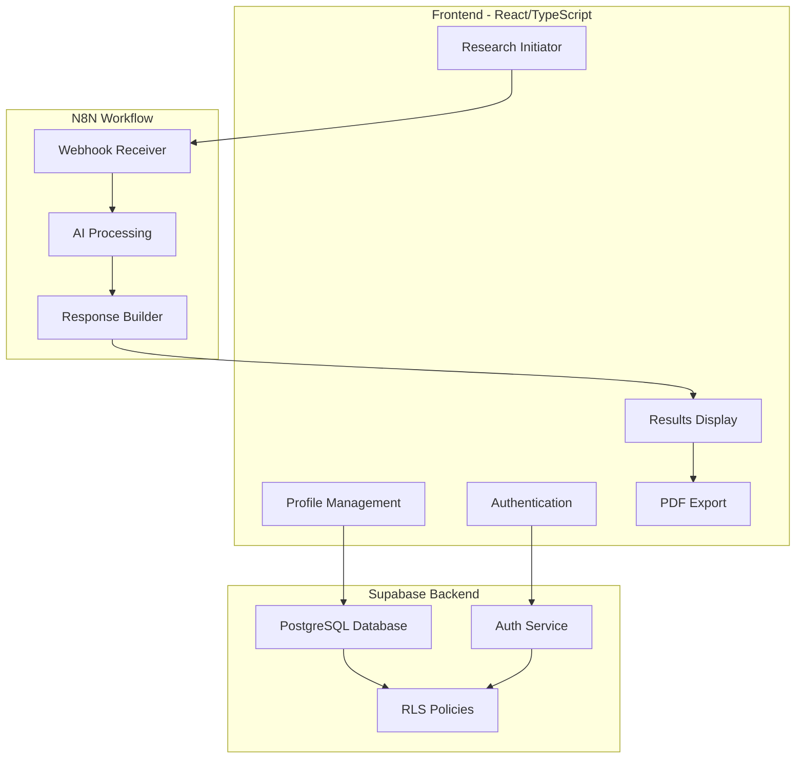
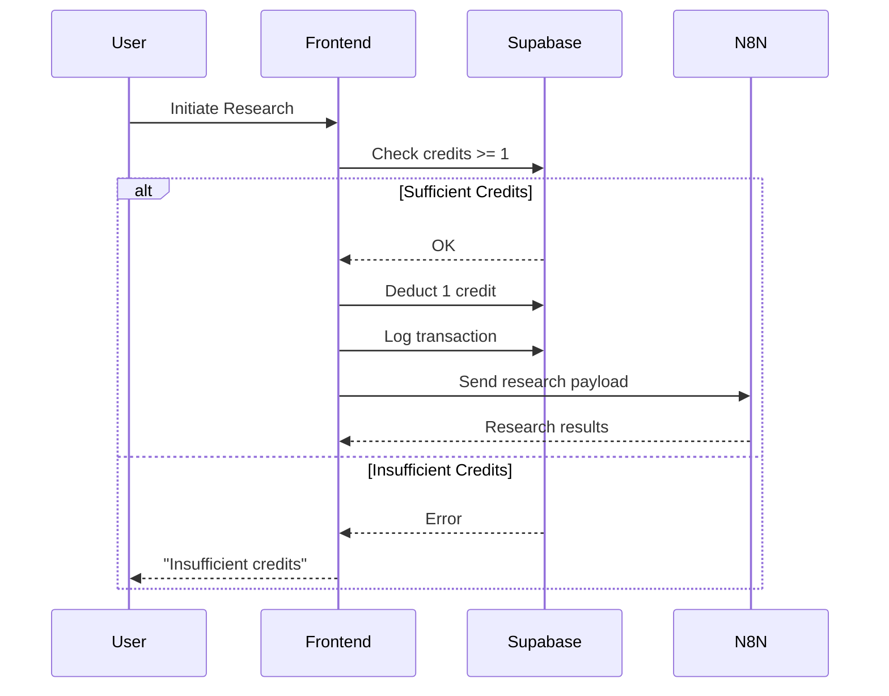
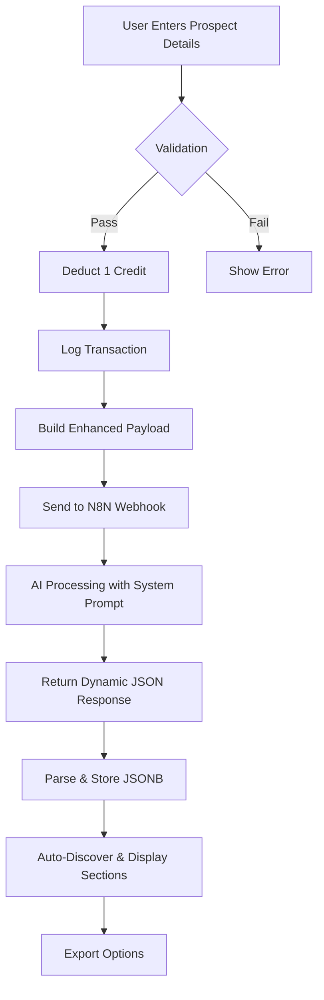
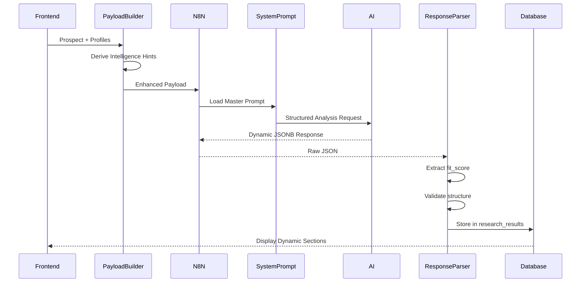
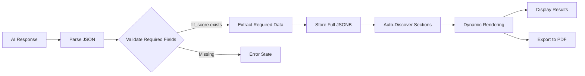
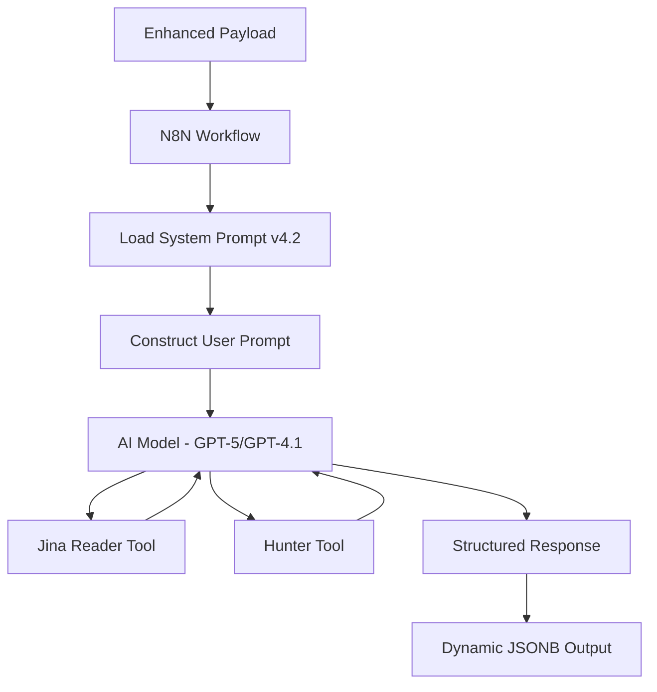
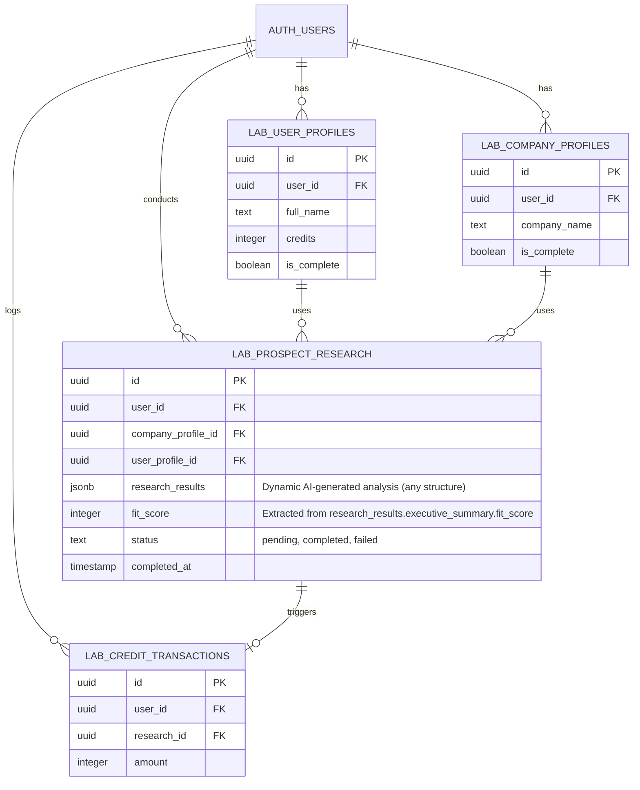

# Research Engine - Product Requirements Document

**Version**: 1.0  
**Last Updated**: 2025-10-03  
**Author**: Magnus Froste

---

## Executive Summary

### Product Vision
Research Engine is an AI-powered prospect analysis platform that transforms how sales and business development professionals research and approach potential clients. By combining intelligent user/company profiling with AI-driven analysis, the system delivers personalized, actionable insights for every prospect.

### Value Proposition
- **Context-Aware Research**: AI analysis informed by your company profile and communication style
- **Actionable Insights**: Structured outputs with fit scores, decision maker analysis, and contact strategies
- **Time Savings**: Minutes instead of hours per prospect research
- **Personalization at Scale**: Maintain quality while increasing prospect volume

### Target Users
- **Primary**: Sales Directors, Business Development Managers, Founders
- **Secondary**: Marketing Directors, Account Executives, Consultants
- **Company Size**: Solo entrepreneurs to medium businesses (1-200 employees)

### Key Differentiators
1. **Dual Profile System**: Both company and user profiles inform every research
2. **Dynamic AI Structure**: Content sections adapt automatically via system prompt
3. **Credit-Based Model**: Clear, predictable pricing (5 free credits to start)
4. **Full Stack Solution**: Auth, database, AI processing, and export in one platform

---

## Table of Contents

1. [Executive Summary](#executive-summary)
2. [System Architecture](#system-architecture)
3. [User Profile System](#user-profile-system)
4. [Company Profile System](#company-profile-system)
5. [Credit System](#credit-system)
6. [Research Flow](#research-flow)
7. [Enhanced Payload Structure](#enhanced-payload-structure)
8. [Dynamic Response Parsing](#dynamic-response-parsing)
9. [AI Prompt Engineering & Analysis Framework](#ai-prompt-engineering--analysis-framework)
10. [Database Schema](#database-schema)
11. [Security & Authentication](#security--authentication)
12. [Export & Reporting](#export--reporting)
13. [Future Roadmap](#future-roadmap)
14. [Appendices](#appendices)

---

## System Architecture

### High-Level Architecture



### Technology Stack

**Frontend**
- React 18 + TypeScript
- Tailwind CSS with semantic design tokens
- Shadcn/ui component library
- React Router for navigation
- React Hook Form + Zod for validation
- React Markdown for dynamic content rendering

**Backend**
- Supabase (PostgreSQL + Auth + RLS)
- N8N for AI workflow orchestration
- Webhook-based communication

**AI Processing**
- Claude/GPT-4 (configurable in N8N)
- System prompt controls all output structure
- JSONB storage for flexible schema

---

## User Profile System

### Overview
User profiles capture individual preferences, communication style, and outreach approach to personalize AI research outputs.

### Complete Field List (26 fields)

#### Section A: Personal Information (5 fields)
1. **full_name** - `text` (required) - User's full name
2. **linkedin_profile** - `text` (optional) - LinkedIn profile URL
3. **current_location** - `text` (optional) - Current city/location
4. **birthplace** - `text` (optional) - Hometown/birthplace
5. **date_of_birth** - `date` (optional) - Date of birth

#### Section B: Role & Context (3 fields)
6. **role_in_organization** - `text` (required) - Select from:
   - CEO/Founder
   - Sales Director/Manager
   - Business Development Manager
   - Marketing Director/Manager
   - Operations Manager
   - Partner/Co-founder
   - Consultant/Advisor
   - Other

7. **outreach_experience** - `text` (required) - Select from:
   - New (< 1 year)
   - Beginner (1-2 years)
   - Experienced (3-5 years)
   - Expert (5+ years)

8. **prospects_per_week** - `text` (required) - Select from:
   - 1-5
   - 6-15
   - 16-30
   - 30+
   - Variable

#### Section C: Communication Style & Personality (3 fields)
9. **communication_style** - `text` (required) - Select from:
   - Direct & to-the-point (business first)
   - Relational & personal (connection first)
   - Analytical & data-driven (facts first)
   - Inspiring & visionary (possibilities first)
   - Consultative & advisory (questions first)

10. **introduction_style** - `text` (required) - Select from predefined templates

11. **credibility_preference** - `text[]` (required) - Multi-select from:
    - Case studies & concrete examples
    - Methodology & frameworks
    - Team credentials & experience
    - Client testimonials & references
    - Industry awards & recognition
    - Personal expertise & track record

#### Section D: Outreach Preferences (3 fields)
12. **preferred_contact_channel** - `text[]` (required) - Multi-select from:
    - LinkedIn message
    - Email outreach
    - Phone call
    - Referral introduction
    - Social media (Twitter, etc.)
    - Event/networking meeting

13. **followup_timing** - `text` (required) - Select from:
    - Quick & persistent (within 3 days)
    - Moderate & respectful (within 1 week)
    - Patient & strategic (within 2 weeks)
    - Varies per prospect

14. **nonresponse_handling** - `text` (required) - Select from:
    - Multiple follow-ups until clear 'no'
    - 2-3 attempts then move on
    - 1 follow-up then stop
    - Depends on prospect value/fit

#### Section E: Value Proposition & Messaging (3 fields)
15. **pain_points_focus** - `text[]` (required) - Multi-select from:
    - Cost/efficiency issues
    - Growth/scaling challenges
    - Technology/digital gaps
    - Compliance/risk issues
    - Process/operational friction
    - Team/organizational challenges
    - Customer experience problems

16. **expertise_positioning** - `text` (required) - Select from:
    - As industry specialist/expert
    - As problem solver/consultant
    - As strategic partner/advisor
    - As innovative solution provider
    - As results-driven implementer

17. **objection_handling** - `text[]` (required) - Multi-select from:
    - Address upfront in initial message
    - Respond when objections arise
    - Use social proof to preempt
    - Ask questions to understand concerns
    - Provide alternatives/flexibility

#### Section F: Meeting & Conversion (3 fields)
18. **meeting_format** - `text[]` (required) - Multi-select from:
    - Video call (Teams/Zoom)
    - Phone call
    - In-person meeting
    - Coffee meeting (informal)
    - Prospect's office visit
    - Flexible - prospect choice

19. **meeting_duration** - `text` (required) - Select from:
    - 15-30 minutes (quick qualification)
    - 30-45 minutes (standard discovery)
    - 45-60 minutes (deep dive)
    - 60+ minutes (comprehensive)

20. **success_metrics** - `text[]` (required) - Multi-select from:
    - Response rate %
    - Meeting booking rate %
    - Qualified opportunities
    - Conversion to proposal
    - Closed deals
    - All of the above

#### Metadata Fields (6 fields)
21. **credits** - `integer` (default: 5) - Available research credits
22. **is_complete** - `boolean` (default: false) - Profile completion status
23. **created_at** - `timestamp` - Profile creation date
24. **updated_at** - `timestamp` - Last modification date
25. **user_id** - `uuid` (required) - Associated user ID
26. **id** - `uuid` (auto-generated) - Primary key

### Database Table
```sql
CREATE TABLE lab_user_profiles (
  id uuid PRIMARY KEY DEFAULT gen_random_uuid(),
  user_id uuid NOT NULL REFERENCES auth.users,
  full_name text NOT NULL,
  linkedin_profile text,
  current_location text,
  birthplace text,
  date_of_birth date,
  role_in_organization text NOT NULL,
  outreach_experience text NOT NULL,
  prospects_per_week text NOT NULL,
  communication_style text NOT NULL,
  introduction_style text NOT NULL,
  credibility_preference text[] NOT NULL DEFAULT '{}',
  preferred_contact_channel text[] NOT NULL DEFAULT '{}',
  followup_timing text NOT NULL,
  nonresponse_handling text NOT NULL,
  pain_points_focus text[] NOT NULL DEFAULT '{}',
  expertise_positioning text NOT NULL,
  objection_handling text[] NOT NULL DEFAULT '{}',
  meeting_format text[] NOT NULL DEFAULT '{}',
  meeting_duration text NOT NULL,
  success_metrics text[] NOT NULL DEFAULT '{}',
  credits integer NOT NULL DEFAULT 5,
  is_complete boolean DEFAULT false,
  created_at timestamp with time zone NOT NULL DEFAULT now(),
  updated_at timestamp with time zone NOT NULL DEFAULT now()
);
```

---

## Company Profile System

### Overview
Company profiles capture business details, offerings, and differentiators to provide context for AI-powered prospect analysis.

### Complete Field List (28 fields)

#### Basic Information (8 fields)
1. **company_name** - `text` (required) - Company name
2. **website_url** - `text` (required) - Company website URL
3. **linkedin_url** - `text` (optional) - Company LinkedIn URL
4. **business_registration** - `text` (optional) - Business registration details
5. **industry** - `text` (required) - Industry classification
6. **years_active** - `text` (optional) - Years in business
7. **company_size** - `text` (required) - Select from:
   - Solo (1 person)
   - Startup (2-10 people)
   - Small Business (11-50 people)
   - Medium Business (51-200 people)
   - Large Business (201-1000 people)
   - Enterprise (1000+ people)

8. **geographic_markets** - `text[]` (required, default: []) - Multi-select from:
   - Local/Regional
   - National
   - International
   - Global

#### Mission & Vision (2 fields)
9. **mission** - `text` (required) - Mission statement
10. **vision** - `text` (optional) - Vision statement

#### Values & Culture (2 fields)
11. **values** - `text[]` (required, default: []) - Multi-select from:
    - Innovation, Quality, Customer Service, Sustainability, Transparency, Collaboration, Excellence, Integrity, Growth, Community Impact

12. **organizational_personality** - `text[]` (required, default: []) - Multi-select from:
    - Remote-First, Hybrid, In-Person, Flexible Hours, Results-Oriented, Collaborative, Fast-Paced, Innovation-Focused

#### Offerings & Services (13 fields)
13. **offering_type** - `text[]` (required, default: []) - Multi-select from:
    - Products, Services, Software, Consulting, E-commerce, SaaS, Hardware, Content

14. **main_offerings** - `text[]` (required, default: []) - Primary products/services
15. **target_industries** - `text[]` (required, default: []) - Target industries
16. **ideal_client_size** - `text[]` (required, default: []) - Preferred client sizes
17. **project_scope** - `text` (required) - Typical project scope
18. **unique_differentiators** - `text[]` (required, default: []) - Unique selling propositions
19. **credentials** - `text[]` (required, default: []) - Professional credentials
20. **typical_results** - `text[]` (required, default: []) - Common outcomes delivered
21. **known_clients** - `boolean` (optional, default: false) - Has notable clients
22. **known_clients_list** - `text` (optional) - List of notable clients
23. **success_story** - `text` (optional) - Detailed success story
24. **delivery_model** - `text[]` (required, default: []) - Service delivery methods
25. **pricing_positioning** - `text` (required) - Pricing strategy
26. **communication_style** - `text` (required) - Preferred communication tone

#### Metadata Fields (2 fields)
27. **is_complete** - `boolean` (default: false) - Profile completion status
28. **user_id** - `uuid` (required) - Associated user ID

Plus automatic: `id`, `created_at`, `updated_at`

### Database Table
```sql
CREATE TABLE lab_company_profiles (
  id uuid PRIMARY KEY DEFAULT gen_random_uuid(),
  user_id uuid NOT NULL REFERENCES auth.users,
  company_name text NOT NULL,
  website_url text NOT NULL,
  linkedin_url text,
  business_registration text,
  industry text NOT NULL,
  years_active text,
  company_size text NOT NULL,
  geographic_markets text[] NOT NULL DEFAULT '{}',
  mission text NOT NULL,
  vision text,
  values text[] NOT NULL DEFAULT '{}',
  organizational_personality text[] NOT NULL DEFAULT '{}',
  offering_type text[] NOT NULL DEFAULT '{}',
  main_offerings text[] NOT NULL DEFAULT '{}',
  target_industries text[] NOT NULL DEFAULT '{}',
  ideal_client_size text[] NOT NULL DEFAULT '{}',
  project_scope text NOT NULL,
  unique_differentiators text[] NOT NULL DEFAULT '{}',
  credentials text[] NOT NULL DEFAULT '{}',
  typical_results text[] NOT NULL DEFAULT '{}',
  known_clients boolean DEFAULT false,
  known_clients_list text,
  success_story text,
  delivery_model text[] NOT NULL DEFAULT '{}',
  pricing_positioning text NOT NULL,
  communication_style text NOT NULL,
  is_complete boolean DEFAULT false,
  created_at timestamp with time zone NOT NULL DEFAULT now(),
  updated_at timestamp with time zone NOT NULL DEFAULT now()
);
```

---

## Credit System

### Overview
Credits control access to AI-powered research. Each user starts with 5 free credits, and each research costs 1 credit.

### Credit Flow



### Credit Allocation
- **Initial Credits**: 5 (set on user profile creation)
- **Research Cost**: 1 credit per prospect research
- **Deduction Timing**: Before sending to N8N webhook
- **Transaction Logging**: All credit changes logged in `lab_credit_transactions`

### Database Tables

**User Credits** (in `lab_user_profiles`)
```sql
credits integer NOT NULL DEFAULT 5
```

**Transaction Log** (`lab_credit_transactions`)
```sql
CREATE TABLE lab_credit_transactions (
  id uuid PRIMARY KEY DEFAULT gen_random_uuid(),
  user_id uuid NOT NULL REFERENCES auth.users,
  amount integer NOT NULL,  -- Negative for deductions
  description text NOT NULL,
  research_id uuid REFERENCES lab_prospect_research,
  created_at timestamp with time zone NOT NULL DEFAULT now()
);
```

### UI Integration
- **Dashboard**: Display current credit balance
- **Research Page**: Show credits before initiating research
- **User Profile**: View credit history and transactions

---

## Research Flow

### Research Initiation Requirements

**Pre-Flight Checks:**
1. ✅ User authenticated (Supabase Auth)
2. ✅ Company profile complete (`is_complete = true`)
3. ✅ User profile complete (`is_complete = true`)
4. ✅ Credits available (`credits >= 1`)

### Research Workflow



### Data Flow Architecture



**Key Components:**
- **Enhanced Payload** (Section 7) - Intelligence-enriched input data
- **System Prompt** (Section 9) - AI analysis framework controller
- **Dynamic Response** (Section 8) - Flexible, future-proof output structure

### Payload Overview

The webhook payload includes:

**Prospect Data**
```json
{
  "prospect_company_name": "string",
  "prospect_website_url": "string (required)",
  "prospect_linkedin_url": "string (optional)"
}
```

**Company Profile Context** (26 fields from `lab_company_profiles`)

**User Profile Context** (20 fields from `lab_user_profiles`)

**Processing Hints** (Auto-generated from profiles)
```json
{
  "focus_areas": ["pain_points", "value_alignment"],
  "communication_tone": "professional",
  "experience_level": "expert",
  "company_maturity": "growth_stage"
}
```

**Metadata**
```json
{
  "research_id": "uuid",
  "user_id": "uuid",
  "timestamp": "ISO 8601",
  "webhook_url": "string"
}
```

### N8N Webhook Integration

**Webhook Configuration:**
- URL stored in Supabase secrets (`COMPANY_RESEARCH_WEBHOOK_URL`)
- POST request with JSON payload
- Timeout: 60 seconds
- Retry: None (manual re-run if needed)

**Expected Response:**
```json
{
  "research_results": {
    // Dynamic JSONB structure
    // Defined by N8N system prompt
  },
  "fit_score": 1-100,
  "decision_makers": {...},
  "contact_strategy": {...},
  "value_proposition": {...}
}
```

**For complete payload and response documentation, see:**
- [Section 7: Enhanced Payload Structure](#enhanced-payload-structure) - Detailed payload architecture
- [Section 8: Dynamic Response Parsing](#dynamic-response-parsing) - Response handling system

---

## Enhanced Payload Structure

### Overview

The enhanced payload provides **stable input structure** to N8N while enabling **dynamic AI-generated output**. The payload structure remains consistent across all research requests, but the AI's system prompt controls what analysis sections are generated.

**Design Philosophy:**
- Frontend sends comprehensive context (user + company profiles + prospect data)
- Backend derives intelligence hints from this context
- N8N system prompt adapts analysis based on these hints
- Output structure can evolve without frontend code changes

### Core Components

#### 1. Prospect Data
```typescript
interface ProspectData {
  company_name: string;
  website_url: string;
  linkedin_url?: string;
  research_type: 'quick' | 'standard' | 'deep';
  notes?: string;
}
```

**Purpose**: Basic information about the target company being researched.

#### 2. Company Profile (Complete Context)
```typescript
interface CompanyProfile {
  company_name: string;
  website_url: string;
  linkedin_url?: string;
  business_registration?: string;
  industry: string;
  company_size: string;
  years_active?: string;
  geographic_markets: string[];
  mission: string;
  vision?: string;
  values: string[];
  organizational_personality: string[];
  offering_type: string[];
  main_offerings: string[];
  target_industries: string[];
  ideal_client_size: string[];
  project_scope: string;
  unique_differentiators: string[];
  credentials: string[];
  typical_results: string[];
  known_clients?: boolean;
  known_clients_list?: string;
  success_story?: string;
  delivery_model: string[];
  pricing_positioning: string;
  communication_style: string;
  // + metadata fields
}
```

**Purpose**: Complete profile of the research requestor's company, used for strategic alignment analysis.

#### 3. User Profile (Complete Context)
```typescript
interface UserProfile {
  full_name: string;
  linkedin_profile?: string;
  current_location?: string;
  birthplace?: string;
  date_of_birth?: Date;
  role_in_organization: string;
  outreach_experience: string;
  prospects_per_week: string;
  communication_style: string;
  introduction_style: string;
  credibility_preference: string[];
  preferred_contact_channel: string[];
  followup_timing: string;
  nonresponse_handling: string;
  pain_points_focus: string[];
  expertise_positioning: string;
  objection_handling: string[];
  meeting_format: string[];
  meeting_duration: string;
  success_metrics: string[];
  // + metadata fields
}
```

**Purpose**: User's complete profile for personalizing analysis tone, depth, and recommendations.

### Intelligence Components

#### 4. Processing Hints (Auto-Generated)
```typescript
interface ProcessingHints {
  research_depth: 'quick' | 'standard' | 'deep';
  focus_areas: string[];
  communication_style: 'professional' | 'casual' | 'consultative';
  industry_context?: string;
  priority_level: 'low' | 'medium' | 'high';
}
```

**Purpose**: Intelligent processing guidance derived from user and company profiles.

**Focus Areas** (examples):
- `decision_makers` - Enhanced decision-making structure analysis
- `pain_points` - Deep challenge identification and positioning
- `contact_info` - Prioritized contact strategy and personas
- `competitive_landscape` - Competitive positioning analysis
- `financial_health` - Business impact and ROI projections
- `growth_opportunities` - Strategic initiative alignment

**Derivation Logic:**
```javascript
function deriveCommunicationStyle(userProfile, companyProfile) {
  if (userProfile.communication_style?.includes('formal') || 
      companyProfile.company_size === 'Enterprise (500+)') {
    return 'professional';
  }
  if (companyProfile.company_size === 'Startup (1-10)' || 
      userProfile.communication_style?.includes('casual')) {
    return 'casual';
  }
  return 'consultative'; // default
}
```

#### 5. Metadata
```typescript
interface PayloadMetadata {
  version: string;
  creator: string;
  processing_context: {
    user_experience_level: 'beginner' | 'intermediate' | 'expert';
    company_maturity: 'startup' | 'growth' | 'enterprise';
    target_market_focus: string;
  };
}
```

**Purpose**: Contextual information for analysis adaptation and personalization.

**Experience Level Derivation:**
```javascript
function deriveExperienceLevel(outreachExperience) {
  const exp = outreachExperience?.toLowerCase() || '';
  if (exp.includes('new') || exp.includes('beginner') || 
      exp.includes('less than 1')) {
    return 'beginner';
  }
  if (exp.includes('expert') || exp.includes('senior') || 
      exp.includes('10+') || exp.includes('extensive')) {
    return 'expert';
  }
  return 'intermediate';
}
```

**Company Maturity Derivation:**
```javascript
function deriveCompanyMaturity(companySize, yearsActive) {
  if (companySize?.includes('Startup') || yearsActive < 3) {
    return 'startup';
  }
  if (companySize?.includes('Enterprise') || yearsActive > 10) {
    return 'enterprise';
  }
  return 'growth';
}
```

### Complete Payload Structure

```typescript
interface EnhancedWebhookPayload {
  prospect_data: ProspectData;
  company_profile: CompanyProfile;
  user_profile: UserProfile;
  processing_hints: ProcessingHints;
  metadata: PayloadMetadata;
}
```

### Payload Generation Process

**Implementation** (`src/lib/webhookPayloadUtils.ts`):

```typescript
function enhanceWebhookPayload(
  prospectData: any, 
  companyProfile: any, 
  userProfile: any,
  researchId: string | null = null
): EnhancedWebhookPayload {
  const processing_hints = {
    research_depth: prospectData.research_type,
    focus_areas: generateFocusAreas(
      prospectData.research_type, 
      userProfile, 
      companyProfile
    ),
    communication_style: deriveCommunicationStyle(userProfile, companyProfile),
    industry_context: companyProfile?.industry,
    priority_level: prospectData.research_type === 'deep' ? 'high' : 
                   prospectData.research_type === 'quick' ? 'low' : 'medium'
  };

  const metadata = {
    version: '1.0.0',
    creator: 'Research Engine v1.0',
    processing_context: {
      user_experience_level: deriveExperienceLevel(userProfile?.outreach_experience),
      company_maturity: deriveCompanyMaturity(
        companyProfile?.company_size, 
        companyProfile?.years_active
      ),
      target_market_focus: companyProfile?.target_market || 'General Market'
    }
  };

  return {
    prospect_data: prospectData,
    company_profile: companyProfile,
    user_profile: userProfile,
    processing_hints,
    metadata
  };
}
```

### Usage in N8N Workflow

**Accessing Payload Data:**
```javascript
// In N8N nodes, access payload data:
const prospectName = $json.prospect_data.company_name;
const researchDepth = $json.processing_hints.research_depth;
const userExperience = $json.metadata.processing_context.user_experience_level;
const focusAreas = $json.processing_hints.focus_areas;
```

**Adaptive Processing:**
```javascript
// Adapt analysis based on hints:
if ($json.processing_hints.research_depth === 'quick') {
  // Use faster model, focus on key sections
  model = 'gpt-4o-mini';
  sections = ['strategic_fit', 'contact_strategy'];
} else if ($json.processing_hints.research_depth === 'deep') {
  // Use advanced model, comprehensive analysis
  model = 'gpt-5';
  sections = ['all'];
}

// Prioritize based on focus areas:
if ($json.processing_hints.focus_areas.includes('decision_makers')) {
  enhanceSections = ['organization_decision_making', 'contact_strategy'];
}
```

### Validation & Best Practices

**Required Field Validation:**
```typescript
function validatePayload(payload: EnhancedWebhookPayload): boolean {
  return !!(
    payload.prospect_data?.company_name &&
    payload.prospect_data?.website_url &&
    payload.processing_hints?.research_depth &&
    payload.metadata?.version
  );
}
```

**Default Value Handling:**
```typescript
const safePayload = {
  ...payload,
  processing_hints: {
    research_depth: 'standard',
    focus_areas: ['strategic_fit', 'decision_makers'],
    communication_style: 'professional',
    priority_level: 'medium',
    ...payload.processing_hints
  }
};
```

**Best Practices:**
1. ✅ Always validate required fields before sending
2. ✅ Provide sensible defaults for missing profile data
3. ✅ Include version in metadata for compatibility
4. ✅ Maintain processing context throughout workflow
5. ✅ Implement fallback strategies for missing intelligence data

**For detailed examples and additional documentation:**
- See `/docs/payload/README.md` for comprehensive payload documentation
- See `/docs/n8n/system-prompt-v4.2.md` for how N8N uses this payload

---

## Dynamic Response Parsing

### Overview

The Research Engine uses a **dynamic response parsing system** that automatically adapts to any AI-generated content structure. This architecture enables the N8N system prompt to control the response structure without requiring frontend code changes.

**Core Principle:** The N8N system prompt is the master controller. The frontend automatically discovers and renders whatever structure the AI returns.

### Architecture



### Response Structure

#### Required Fields
```typescript
interface MinimumResponse {
  executive_summary: {
    fit_score: number;  // 1-100, REQUIRED
    // ... other fields flexible
  };
  // All other sections: DYNAMIC and OPTIONAL
}
```

#### Dynamic Sections (Examples)
The AI can generate ANY sections it wants. Common examples:

```typescript
interface DynamicResponse {
  executive_summary: {
    fit_score: number;
    overall_assessment: string;
    key_opportunities: string[];
    potential_challenges: string[];
  };
  strategic_fit?: {
    alignment_score: number;
    strengths: string[];
    opportunities: string[];
  };
  decision_makers?: {
    key_contacts: Contact[];
    organizational_structure: string;
  };
  // Any other sections the AI generates...
}
```

**Key Point:** Only `executive_summary.fit_score` is required. Everything else is discovered dynamically.

### Response Processing Flow

#### 1. Parse & Validate (`src/lib/researchResponseUtils.ts`)

```typescript
export const parseAndSaveN8nResponse = async (
  responseText: string,
  researchId: string,
  prospectCompanyName: string
): Promise<{ success: boolean; fitScore?: number; error?: string }> => {
  try {
    // Parse the raw JSON response
    const parsedResponse = JSON.parse(responseText);
    
    // Extract the REQUIRED fit_score
    const fitScore = parsedResponse?.executive_summary?.fit_score;
    
    if (!fitScore) {
      throw new Error('Response missing required fit_score');
    }
    
    // Store the ENTIRE response as JSONB
    const { error } = await supabase
      .from('lab_prospect_research')
      .update({
        research_results: parsedResponse,  // Full dynamic structure
        fit_score: fitScore,               // Extracted for querying
        status: 'completed',
        completed_at: new Date().toISOString()
      })
      .eq('id', researchId);
    
    if (error) throw error;
    
    return { success: true, fitScore };
  } catch (error) {
    console.error('Failed to parse N8N response:', error);
    return { 
      success: false, 
      error: error.message 
    };
  }
};
```

#### 2. Auto-Discover Sections (`src/components/lab/ResearchResults.tsx`)

```typescript
const ResearchResults = ({ research }) => {
  const { research_results } = research;
  
  // Auto-discover all sections except executive_summary
  const dynamicSections = Object.keys(research_results || {})
    .filter(key => key !== 'executive_summary');
  
  return (
    <div>
      {/* Executive Summary - Always First */}
      <ExecutiveSummary data={research_results.executive_summary} />
      
      {/* Dynamic Sections - Auto-Discovered */}
      {dynamicSections.map(sectionKey => (
        <DynamicSection
          key={sectionKey}
          title={getSectionTitle(sectionKey)}
          content={research_results[sectionKey]}
        />
      ))}
    </div>
  );
};
```

#### 3. Section Title Mapping

```typescript
const sectionMapping: Record<string, string> = {
  strategic_fit: "Strategic Fit Analysis",
  decision_makers: "Decision Makers & Contacts",
  organization_decision_making: "Organizational Decision Making",
  challenges_market_position: "Challenges & Market Position",
  technology_integration: "Technology Integration",
  financial_impact: "Financial Impact & ROI",
  contact_strategy: "Contact Strategy",
  implementation_roadmap: "Implementation Roadmap",
  // Fallback for unknown sections
  [key]: key.split('_').map(w => 
    w.charAt(0).toUpperCase() + w.slice(1)
  ).join(' ')
};
```

### Content Rendering System

#### Multi-Type Content Handler

```typescript
const renderContent = (content: any): React.ReactNode => {
  // Handle strings (including markdown)
  if (typeof content === 'string') {
    return <ReactMarkdown remarkPlugins={[remarkGfm]}>{content}</ReactMarkdown>;
  }
  
  // Handle arrays
  if (Array.isArray(content)) {
    return (
      <ul className="list-disc list-inside space-y-1">
        {content.map((item, i) => (
          <li key={i}>{renderContent(item)}</li>
        ))}
      </ul>
    );
  }
  
  // Handle objects
  if (typeof content === 'object' && content !== null) {
    return (
      <div className="space-y-4">
        {Object.entries(content).map(([key, value]) => (
          <div key={key}>
            <strong className="font-semibold">
              {key.replace(/_/g, ' ').toUpperCase()}:
            </strong>
            <div className="ml-4">{renderContent(value)}</div>
          </div>
        ))}
      </div>
    );
  }
  
  // Fallback for primitives
  return <span>{String(content)}</span>;
};
```

### CSS-Based Markdown Formatting

**Enhanced Typography** (`src/index.css`):
```css
/* Markdown content styling for dynamic AI responses */
.prose strong {
  @apply font-semibold text-foreground;
  margin-right: 0.5rem;
}

.prose p {
  @apply mb-4 leading-relaxed;
}

.prose ul, .prose ol {
  @apply ml-6 mb-4 space-y-2;
}

.prose li {
  @apply leading-relaxed;
}

/* Ensure proper spacing in dynamic sections */
.research-content > * + * {
  @apply mt-4;
}
```

### Export Integration

**PDF Export** (`src/lib/exportUtils.ts`):
```typescript
export const exportResearchToPDF = async (research: any) => {
  const { research_results, prospect_company_name } = research;
  
  // Automatically includes ALL dynamic sections
  const allSections = Object.keys(research_results);
  
  // No code changes needed when AI adds new sections
  allSections.forEach(sectionKey => {
    const sectionTitle = getSectionTitle(sectionKey);
    const sectionContent = research_results[sectionKey];
    
    // Render to PDF with proper formatting
    addSectionToPDF(sectionTitle, sectionContent);
  });
};
```

**JSON Export:**
```typescript
// Export raw JSONB for data portability
const exportJSON = () => {
  const blob = new Blob(
    [JSON.stringify(research.research_results, null, 2)],
    { type: 'application/json' }
  );
  downloadBlob(blob, `${prospect_company_name}_data.json`);
};
```

### Database Storage

**JSONB Field** (`lab_prospect_research.research_results`):
```sql
CREATE TABLE lab_prospect_research (
  -- ... other fields
  research_results jsonb,  -- Stores ENTIRE dynamic response
  fit_score integer,       -- Extracted for easy querying
  -- ... other fields
);

-- Index for performance
CREATE INDEX idx_research_fit_score 
ON lab_prospect_research(fit_score DESC);

-- JSONB query capabilities
SELECT * FROM lab_prospect_research
WHERE research_results->'executive_summary'->>'fit_score' > '70';
```

### Benefits of Dynamic Architecture

1. **Future-Proof**: Add new analysis sections without code deployment
2. **System Prompt Control**: N8N controls structure via prompts, not hardcode
3. **Flexible Schema**: Adapt to different AI models and analysis types
4. **Zero Frontend Updates**: New sections auto-render immediately
5. **Version Compatibility**: Old and new response formats coexist
6. **Export Continuity**: PDF/JSON exports work regardless of structure

### Example Evolution

**Version 1 Response:**
```json
{
  "executive_summary": {
    "fit_score": 85,
    "overview": "Strong alignment..."
  },
  "decision_makers": {...}
}
```

**Version 2 Response (New Sections):**
```json
{
  "executive_summary": {
    "fit_score": 85,
    "overview": "Strong alignment..."
  },
  "decision_makers": {...},
  "competitive_analysis": {...},    // NEW - auto-renders
  "technology_stack": {...},        // NEW - auto-renders
  "sustainability_alignment": {...} // NEW - auto-renders
}
```

**No frontend code changes required!**

### Error Handling

```typescript
// Graceful degradation
const renderSection = (sectionKey: string, content: any) => {
  try {
    return renderContent(content);
  } catch (error) {
    console.error(`Failed to render section ${sectionKey}:`, error);
    return (
      <div className="text-muted-foreground italic">
        Unable to display this section. Raw data available in JSON export.
      </div>
    );
  }
};
```

**For detailed examples and additional documentation:**
- See `/docs/response/README.md` for comprehensive response documentation
- See `/docs/n8n/system-prompt-v4.2.md` for AI output structure control

---

## AI Prompt Engineering & Analysis Framework

### Overview

The Research Engine uses the **Enhanced Wassching Method** as its AI analysis framework, controlled entirely through the N8N system prompt. The system prompt defines the analysis structure, reasoning approach, and output format.

### Architecture



### System Prompt Architecture

**Location:** `/docs/n8n/system-prompt-v4.2.md`

**Core Components:**
1. **Analysis Framework** - Enhanced Wassching Method (7 sections)
2. **Tool Orchestration** - Jina Reader (web scraping), Hunter (contact discovery)
3. **Adaptive Persona** - Adjusts tone based on user experience level
4. **Output Structure** - JSON with pre-formatted Markdown sections
5. **Quality Standards** - Scoring, confidence levels, quantification

### Enhanced Wassching Method Framework

**7 Core Analysis Sections:**

1. **Strategic Fit** - Alignment between prospect and your offerings
2. **Decision-Maker Analysis** - Key contacts and organizational structure
3. **Change Capacity** - Readiness and ability to implement solutions
4. **Challenges & Market Position** - Pain points and competitive landscape
5. **Technology Integration** - Technical readiness and compatibility
6. **Financial Impact & ROI** - Business case and value quantification
7. **Contact Strategy** - Personalized outreach recommendations
8. **Implementation Roadmap** - Action plan with timelines

### User Prompt Construction

**Location:** `/docs/n8n/user-prompt-v4.2.md`

**Structure:**
```markdown
# Research Brief

## Prospect Information
- Company: {prospect_data.company_name}
- Website: {prospect_data.website_url}
- Research Depth: {processing_hints.research_depth}

## Your Company Context
[Complete company_profile data]

## Your Approach & Preferences
[Complete user_profile data]

## Intelligence Hints
- Focus Areas: {processing_hints.focus_areas}
- Communication Style: {processing_hints.communication_style}
- Experience Level: {metadata.processing_context.user_experience_level}
- Company Maturity: {metadata.processing_context.company_maturity}

## Instructions
Analyze the prospect using the Enhanced Wassching Method, adapting your 
output based on the intelligence hints provided above.
```

### Model Selection Strategy

**Primary Model:** GPT-5 (gpt-5-2025-08-07)
- Best for comprehensive analysis
- Superior reasoning capabilities
- Handles complex strategic alignment

**Fast Model:** GPT-4.1 Mini (gpt-4.1-mini-2025-04-14)
- Quick research type
- Simpler prospects
- Budget-conscious analysis

**Reasoning Model:** O4 Mini (o4-mini-2025-04-16)
- Complex multi-step problems
- Advanced decision-tree analysis
- Financial modeling scenarios

### Tool Orchestration

**Jina Reader** (`https://r.jina.ai/{url}`)
- Extracts clean website content
- Returns markdown-formatted text
- Used first for all website analysis

**Hunter** (Contact Discovery API)
- Finds decision-maker emails
- Only used when needed
- Respects API rate limits

**Tool Usage Pattern:**
```javascript
// N8N Workflow Logic
1. Receive enhanced payload
2. Use Jina Reader on prospect website_url
3. If focus_areas includes 'decision_makers':
   - Use Hunter to find contacts
4. Feed all data to AI with system prompt
5. Return structured JSON response
```

### Adaptive Output Control

**Experience Level Adaptation:**

**Beginner:**
- Simplified explanations
- Step-by-step guidance
- More context and definitions
- Conservative recommendations

**Intermediate:**
- Balanced detail level
- Professional terminology
- Moderate complexity
- Strategic options

**Expert:**
- Dense insights
- Advanced analysis
- Minimal hand-holding
- Complex strategic recommendations

**Communication Style Adaptation:**

**Professional:**
- Formal tone
- Data-driven language
- Executive summary focus
- Structured formatting

**Casual:**
- Conversational tone
- Relatable examples
- Friendly language
- Less rigid structure

**Consultative:**
- Advisory tone
- Question-based insights
- Strategic frameworks
- Partnership language

### Expected Output Structure

```json
{
  "executive_summary": {
    "fit_score": 85,
    "overall_assessment": "**Markdown formatted** string",
    "key_opportunities": ["...", "...", "..."],
    "potential_challenges": ["...", "...", "..."],
    "confidence_level": "High"
  },
  "strategic_fit": {
    "alignment_score": 90,
    "analysis": "**Markdown formatted** deep analysis",
    "strengths": ["...", "..."],
    "opportunities": ["...", "..."]
  },
  // ... other sections as defined by system prompt
}
```

### Quality Standards

**Scoring Methodology:**
- Fit Score: 1-100 (overall alignment)
- Section Scores: 1-100 (specific alignment metrics)
- Confidence Levels: Low, Medium, High, Very High

**Financial Quantification:**
- Potential ROI percentages
- Cost saving estimates
- Revenue opportunity ranges
- Timeline projections

**Contact Details:**
- Full names and titles
- Email addresses (when available)
- LinkedIn profiles
- Phone numbers (when available)

### Prompt Version Management

**Current Version:** v4.2
**Location:** `/docs/n8n/system-prompt-v4.2.md`
**Changelog:** See `/docs/n8n/README.md`

**Versioning Strategy:**
- System prompt updates don't require code changes
- N8N workflow references latest prompt version
- Old research results remain compatible
- A/B testing enabled through version switching

### Integration with Payload & Response

**Data Flow:**
1. Frontend builds **Enhanced Payload** (Section 7)
2. N8N loads **System Prompt v4.2**
3. System prompt processes payload data
4. AI generates **Dynamic Response** (Section 8)
5. Response stored as JSONB
6. Frontend auto-renders sections

**Cross-References:**
- [Enhanced Payload Structure](#enhanced-payload-structure) - Input data
- [Dynamic Response Parsing](#dynamic-response-parsing) - Output handling
- `/docs/n8n/system-prompt-v4.2.md` - Complete prompt text
- `/docs/n8n/user-prompt-v4.2.md` - User prompt construction
- `/docs/n8n/README.md` - N8N workflow documentation

**Storage Table** (`lab_prospect_research`)
```sql
CREATE TABLE lab_prospect_research (
  id uuid PRIMARY KEY DEFAULT gen_random_uuid(),
  user_id uuid NOT NULL REFERENCES auth.users,
  company_profile_id uuid NOT NULL,
  user_profile_id uuid NOT NULL,
  prospect_company_name text NOT NULL,
  prospect_website_url text NOT NULL,
  prospect_linkedin_url text,
  research_type text NOT NULL DEFAULT 'standard',
  webhook_url text NOT NULL,
  status text NOT NULL DEFAULT 'pending',  -- pending, completed, failed
  research_results jsonb,  -- Dynamic JSONB: stores entire AI response
  fit_score integer,       -- Extracted from research_results for querying
  decision_makers jsonb,   -- Legacy: duplicates data from research_results
  contact_strategy jsonb,  -- Legacy: duplicates data from research_results
  value_proposition jsonb, -- Legacy: duplicates data from research_results
  started_at timestamp,
  completed_at timestamp,
  error_message text,
  is_starred boolean DEFAULT false,
  tags text[],
  notes text,
  exported_at timestamp,
  created_at timestamp with time zone NOT NULL DEFAULT now(),
  updated_at timestamp with time zone NOT NULL DEFAULT now()
);
```

---

## Database Schema

### Core Tables Overview



### Dynamic JSONB Field: `research_results`

The `research_results` field in `lab_prospect_research` stores the complete AI-generated analysis in JSONB format, enabling a future-proof, flexible schema.

**Key Characteristics:**
- **No Fixed Schema**: Adapts to any AI output structure
- **Queryable**: PostgreSQL JSONB operators enable complex queries
- **Indexable**: Can create GIN indexes for performance
- **Version Compatible**: Old and new response formats coexist

**Storage Example:**
```sql
-- Store dynamic response
UPDATE lab_prospect_research
SET research_results = '{
  "executive_summary": {
    "fit_score": 85,
    "overall_assessment": "Strong alignment...",
    "key_opportunities": ["..."]
  },
  "strategic_fit": {...},
  "decision_makers": {...}
  -- Any other sections AI generates
}'::jsonb
WHERE id = 'research-uuid';
```

**Query Examples:**
```sql
-- Extract fit_score for filtering
SELECT prospect_company_name, 
       research_results->'executive_summary'->>'fit_score' as fit_score
FROM lab_prospect_research
WHERE (research_results->'executive_summary'->>'fit_score')::int > 70;

-- Check if section exists
SELECT * FROM lab_prospect_research
WHERE research_results ? 'competitive_analysis';

-- Full-text search within JSONB
SELECT * FROM lab_prospect_research
WHERE research_results::text ILIKE '%technology stack%';
```

**Performance Optimization:**
```sql
-- Index for fit_score queries
CREATE INDEX idx_research_fit_score 
ON lab_prospect_research((research_results->'executive_summary'->>'fit_score'));

-- GIN index for general JSONB queries
CREATE INDEX idx_research_results_gin 
ON lab_prospect_research USING GIN (research_results);
```

### Row Level Security (RLS) Policies

**All `lab_*` tables enforce user-level access:**

```sql
-- Example RLS policy (applied to all lab_ tables)
CREATE POLICY "Users can view their own records"
ON lab_user_profiles FOR SELECT
USING (auth.uid() = user_id);

CREATE POLICY "Users can insert their own records"
ON lab_user_profiles FOR INSERT
WITH CHECK (auth.uid() = user_id);

CREATE POLICY "Users can update their own records"
ON lab_user_profiles FOR UPDATE
USING (auth.uid() = user_id);

CREATE POLICY "Users can delete their own records"
ON lab_user_profiles FOR DELETE
USING (auth.uid() = user_id);
```

**Demo Override (Development Only):**
```sql
-- Temporary demo policy for testing
CREATE POLICY "Allow demo operations"
ON lab_user_profiles FOR ALL
USING (true)
WITH CHECK (true);
```

---

## Security & Authentication

### Authentication
- **Provider**: Supabase Auth
- **Methods**: Email/Password (verification enabled)
- **Session Management**: `AuthContext` provider
- **Protected Routes**: `ProtectedRoute` component wrapper

### Row Level Security (RLS)
- **Enabled**: All `lab_*` tables
- **Policy**: User can only access records where `user_id = auth.uid()`
- **Enforcement**: PostgreSQL level (cannot be bypassed)

### Secret Management
- **Storage**: Supabase secrets (encrypted)
- **Access**: Edge functions only (not exposed to frontend)
- **Secrets**:
  - `COMPANY_RESEARCH_WEBHOOK_URL` - N8N webhook endpoint
  - `N8N_API_KEY` - N8N authentication (if required)
  - `SUPABASE_SERVICE_ROLE_KEY` - Admin operations

### Input Validation
- **Library**: Zod schemas
- **Validation Points**: 
  - Form submissions
  - API requests
  - Webhook payloads
- **Error Handling**: User-friendly messages via toast notifications

---

## Export & Reporting

### PDF Export
- **Library**: jsPDF + html2canvas
- **Trigger**: Export button on research results page
- **Content**: Full research results with branding
- **Filename**: `{prospect_company_name}_research_{date}.pdf`

### Export Tracking
- **Field**: `lab_prospect_research.exported_at`
- **Purpose**: Track which research has been exported
- **UI**: Show export status in research list

### Data Export Options (Future)
- CSV export of research list
- Batch PDF generation
- Integration with CRM systems

---

## Future Roadmap

### Phase 1: Credit Top-Up (Q1 2025)
- Stripe integration for credit purchases
- Credit packages (10, 25, 50, 100)
- Subscription plans (monthly credit allocation)
- Invoice generation

### Phase 2: Template System (Q2 2025)
- Custom research templates
- Template marketplace
- Industry-specific templates
- Template sharing

### Phase 3: Team Features (Q2 2025)
- Multi-user accounts
- Shared company profiles
- Team credit pools
- Role-based permissions

### Phase 4: Advanced Analytics (Q3 2025)
- Research success tracking
- A/B testing of approaches
- Performance dashboards
- ROI calculations

### Phase 5: CRM Integration (Q3 2025)
- HubSpot integration
- Salesforce connector
- Pipedrive sync
- Custom webhook endpoints

### Phase 6: AI Enhancements (Q4 2025)
- Multi-model support (Claude, GPT-4, Gemini)
- Custom AI fine-tuning
- Voice note analysis
- Automated follow-up suggestions

---

## Appendices

### A. API Endpoints

**Supabase Client Operations:**
```typescript
// User Profile
await supabase.from('lab_user_profiles').select('*').single()
await supabase.from('lab_user_profiles').update({...}).eq('user_id', userId)

// Company Profile
await supabase.from('lab_company_profiles').select('*').single()
await supabase.from('lab_company_profiles').update({...}).eq('user_id', userId)

// Research
await supabase.from('lab_prospect_research').insert({...})
await supabase.from('lab_prospect_research').select('*').order('created_at', {ascending: false})

// Credits
await supabase.from('lab_user_profiles').update({credits: credits - 1}).eq('user_id', userId)
await supabase.from('lab_credit_transactions').insert({...})
```

### B. Environment Variables

**Not Used** - Lovable/Supabase does not support `VITE_*` environment variables.

All configuration stored in:
- Supabase secrets (webhooks, API keys)
- Database tables (user preferences)
- Hardcoded project references (Supabase project ID/anon key)

### C. Design System Tokens

**Semantic Colors** (from `index.css`):
```css
:root {
  --background: hsl(0 0% 100%);
  --foreground: hsl(222.2 84% 4.9%);
  --primary: hsl(221.2 83.2% 53.3%);
  --secondary: hsl(210 40% 96.1%);
  --accent: hsl(210 40% 96.1%);
  --muted: hsl(210 40% 96.1%);
  --destructive: hsl(0 84.2% 60.2%);
  --border: hsl(214.3 31.8% 91.4%);
}
```

**Usage**: Always use semantic tokens, never direct colors (e.g., `text-foreground` not `text-black`)

### D. Component Library

**Shadcn/ui Components Used:**
- Button, Input, Textarea, Select
- Card, Badge, Separator
- Dialog, Sheet, Popover
- Tabs, Accordion, Collapsible
- Form, Label, Checkbox, RadioGroup
- Toast, Alert, Progress
- Skeleton (loading states)

---

## Document Control

**Change Log:**

| Version | Date | Author | Changes |
|---------|------|--------|---------|
| 1.0 | 2025-10-03 | Magnus Froste | Initial PRD creation |
| 1.1 | 2025-10-03 | Magnus Froste | Added Table of Contents, Enhanced Payload Structure (Section 7), Dynamic Response Parsing (Section 8), AI Prompt Engineering Framework (Section 9), updated Database Schema with JSONB details |

**Review Schedule:**
- Monthly review for accuracy
- Update after major feature releases
- Quarterly alignment with roadmap

**Distribution:**
- Internal team documentation
- Stakeholder presentations
- Developer onboarding

---

*End of Product Requirements Document*
