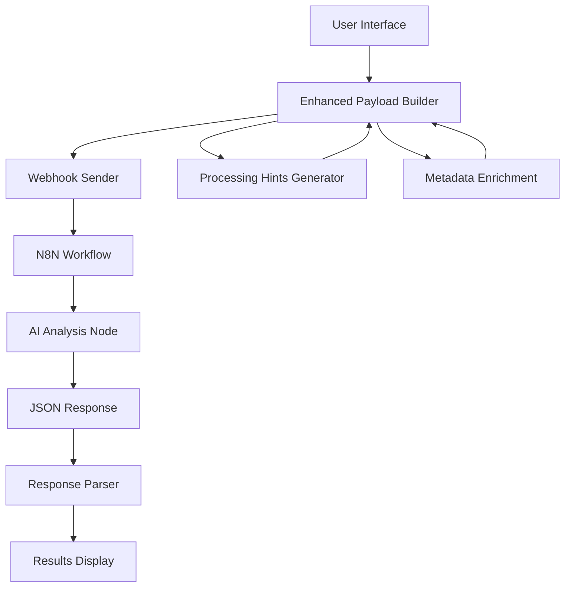

# Research Engine Architecture

The Research Engine is a comprehensive prospect analysis system that combines intelligent payload enhancement with AI-powered research through N8N workflows.

## System Overview



## Core Components

### 1. Frontend Application (React/TypeScript)
- **User Interface**: Research initiation and results display
- **Payload Enhancement**: Intelligent processing hints and metadata generation
- **Profile Management**: User and company profile storage (Supabase)
- **Results Parsing**: JSON response parsing and display

### 2. Enhanced Payload System
- **Intelligent Hints**: Dynamic processing guidance based on user/company profiles
- **Metadata Enrichment**: Context-aware metadata for personalized analysis
- **Payload Structure**: Comprehensive data package for AI analysis

### 3. N8N Integration
- **Webhook Receiver**: Accepts enhanced payload from frontend
- **AI Processing Node**: Processes payload using system prompt
- **Response Formatting**: Ensures proper JSON structure

### 4. AI Analysis Engine
- **System Prompt**: Master controller for all content structure and sections
- **Dynamic Content Generation**: AI creates any sections based on system prompt
- **JSONB Storage**: Flexible storage for any AI-generated analysis structure
- **Auto-Adaptation**: UI and exports automatically handle new sections

## Data Flow

### 1. Research Initiation
```
User Profile + Company Profile + Prospect Data
↓
Processing Hints Generation (focus areas, communication style, etc.)
↓
Metadata Enrichment (experience level, company maturity, etc.)
↓
Enhanced Webhook Payload
```

### 2. N8N Processing
```
Enhanced Payload → N8N Webhook → AI Node (System Prompt) → JSON Response
```

### 3. Response Handling
```
JSON Response → Dynamic Parser → JSONB Storage → Dynamic UI Rendering → Auto-Export
```

## Key Features

### Intelligent Payload Enhancement
- **Focus Areas**: Dynamic analysis prioritization
- **Communication Style**: Tone adaptation (professional/casual/consultative)
- **Experience Level**: Output complexity adjustment
- **Company Maturity**: Context-aware insights

### Dynamic Content Architecture
- **Master Control**: N8N system prompt defines all content structure
- **Flexible Sections**: AI generates any sections based on system prompt
- **Auto-Discovery**: Frontend automatically displays all generated sections
- **Future-Proof Design**: New sections appear automatically without code changes

### Adaptive Analysis Framework
- **System Prompt Driven**: All analysis structure controlled by N8N system prompt
- **JSONB Flexibility**: Dynamic storage accommodates any AI-generated structure
- **Zero Code Changes**: New sections automatically integrate into UI and exports
- **Content Evolution**: Analysis framework evolves through system prompt updates only

## Technology Stack

### Frontend
- **React 18** with TypeScript
- **Tailwind CSS** for styling with design system
- **Shadcn/ui** components
- **React Router** for navigation
- **React Hook Form** for form handling

### Backend Integration
- **Supabase** for data storage (profiles, research records)
- **N8N** for AI workflow orchestration
- **Webhook Integration** for payload transmission

### AI Processing
- **Claude/GPT-4** (configured in N8N)
- **Dynamic Analysis Framework** (system prompt controlled)
- **JSONB-structured** responses (flexible schema)
- **Content Master Control** via N8N system prompt

## Security Considerations

- **Environment Variables**: Webhook URLs stored securely
- **Input Validation**: Payload validation before transmission
- **Error Handling**: Comprehensive error handling and user feedback
- **Rate Limiting**: Handled at N8N workflow level

## Performance Optimization

- **Payload Compression**: Efficient data structure
- **Async Processing**: Non-blocking webhook requests
- **Response Caching**: Results stored in Supabase
- **Loading States**: User feedback during processing

## Scalability

- **Stateless Design**: No server-side state management
- **N8N Scaling**: Horizontal scaling through N8N
- **Database Optimization**: Efficient Supabase queries
- **Component Architecture**: Modular, reusable components