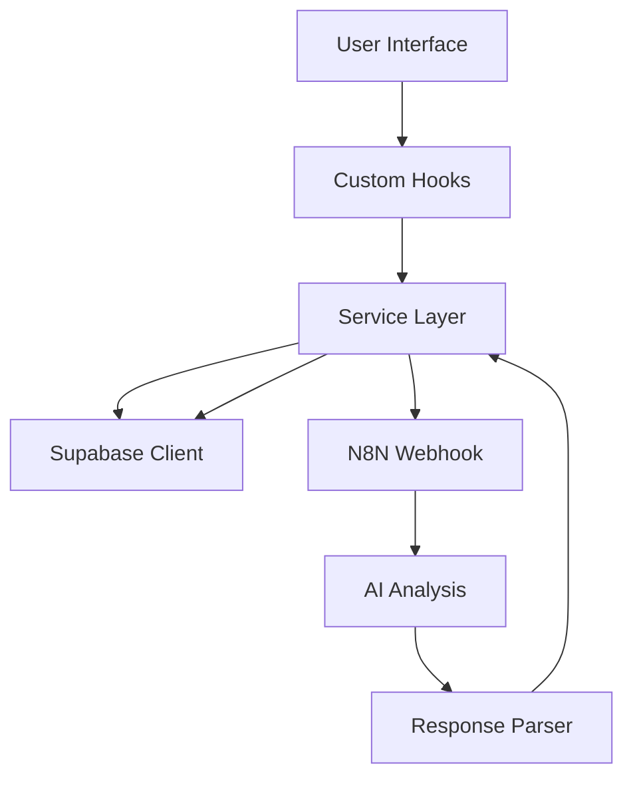

# Research Engine Architecture

The Research Engine is a comprehensive prospect analysis system that combines intelligent payload enhancement with AI-powered research through N8N workflows.

## Architecture Overview

The codebase follows a clear **Data-Model-View** separation pattern:

```
┌─────────────────────────────────────────────────────────────┐
│                      VIEW LAYER                              │
│  Pages & Components (React)                                  │
│  src/pages/, src/components/                                 │
└─────────────────────────────────────────────────────────────┘
                            │
                            ▼
┌─────────────────────────────────────────────────────────────┐
│                      HOOK LAYER                              │
│  Custom React Hooks for state & data management              │
│  src/hooks/                                                  │
│  - useProfiles, useCredits, useResearch, useStartResearch   │
└─────────────────────────────────────────────────────────────┘
                            │
                            ▼
┌─────────────────────────────────────────────────────────────┐
│                    SERVICE LAYER                             │
│  Business logic & data operations                            │
│  src/services/                                               │
│  - profileService, creditService, researchService, webhook  │
└─────────────────────────────────────────────────────────────┘
                            │
                            ▼
┌─────────────────────────────────────────────────────────────┐
│                      TYPE LAYER                              │
│  Domain types & interfaces                                   │
│  src/types/                                                  │
│  - profiles.ts, research.ts, credits.ts                     │
└─────────────────────────────────────────────────────────────┘
                            │
                            ▼
┌─────────────────────────────────────────────────────────────┐
│                      DATA LAYER                              │
│  Supabase Client & External APIs                             │
│  src/integrations/supabase/                                  │
└─────────────────────────────────────────────────────────────┘
```

## Layer Responsibilities

### 1. View Layer (`src/pages/`, `src/components/`)
- React components for UI rendering
- User interaction handling
- No direct database calls
- Uses hooks for data access

### 2. Hook Layer (`src/hooks/`)
- Custom React hooks for reactive data
- State management with useState/useEffect
- Composes services for data fetching
- Handles loading/error states

| Hook | Purpose |
|------|---------|
| `useProfiles` | Fetch user & company profiles |
| `useCredits` | Fetch user credit balance |
| `useResearchList` | Fetch user's research list |
| `useResearchDetail` | Fetch single research item |
| `useStartResearch` | Orchestrate research initiation |

### 3. Service Layer (`src/services/`)
- All database operations
- Business logic implementation
- External API calls (webhooks)
- No React dependencies

| Service | Purpose |
|---------|---------|
| `profileService` | CRUD for user & company profiles |
| `creditService` | Credit balance & transactions |
| `researchService` | Research CRUD & status updates |
| `webhookService` | Webhook payload building & sending |

### 4. Type Layer (`src/types/`)
- TypeScript interfaces & types
- Domain models
- Form data types
- Constants

| File | Contents |
|------|----------|
| `profiles.ts` | UserProfile, CompanyProfile types |
| `research.ts` | ProspectResearch, ResearchFormData |
| `credits.ts` | CreditTransaction, CREDIT_PACKAGES |

### 5. Data Layer (`src/integrations/supabase/`)
- Supabase client configuration
- Auto-generated types from database

## System Flow



## Data Flow: Research Initiation

```
1. User submits research form (View)
       │
       ▼
2. useStartResearch hook orchestrates (Hook)
       │
       ├── checkUserCredits (Service)
       ├── getProfiles (Service)
       ├── createResearchRecord (Service)
       ├── deductCredits (Service)
       └── sendWebhookInBackground (Service)
              │
              ▼
3. N8N processes webhook → AI analysis
       │
       ▼
4. parseAndSaveN8nResponse updates DB (Lib)
       │
       ▼
5. useResearchList refetches → UI updates (Hook → View)
```

## Key Principles

1. **Separation of Concerns**: Views don't access database directly
2. **Single Responsibility**: Each service handles one domain
3. **Type Safety**: All data flows through typed interfaces
4. **Reusability**: Services can be used by multiple hooks/components
5. **Testability**: Services are pure functions, easy to unit test

## Directory Structure

```
src/
├── components/          # UI components (View)
│   ├── lab/            # Research-specific components
│   └── ui/             # Shadcn/ui primitives
├── hooks/              # Custom React hooks (Hook Layer)
│   ├── useProfiles.ts
│   ├── useCredits.ts
│   ├── useResearch.ts
│   └── useStartResearch.ts
├── services/           # Business logic (Service Layer)
│   ├── profileService.ts
│   ├── creditService.ts
│   ├── researchService.ts
│   └── webhookService.ts
├── types/              # Domain types (Type Layer)
│   ├── profiles.ts
│   ├── research.ts
│   └── credits.ts
├── lib/                # Utilities
│   ├── exportUtils.ts
│   ├── researchResponseUtils.ts
│   └── webhookPayloadUtils.ts
├── pages/              # Route pages (View)
├── contexts/           # React contexts
└── integrations/       # External integrations (Data)
    └── supabase/
```

## Database Tables

### User & Profiles
- `lab_user_profiles` - User details, credits, preferences (RLS: user_id)
- `lab_company_profiles` - Company info, offerings, differentiators (RLS: user_id)

### Research
- `lab_prospect_research` - Research records with JSONB results (RLS: user_id)
- `lab_credit_transactions` - Credit usage history (RLS: user_id)

### Templates
- `lab_research_templates` - Custom research templates (RLS: user_id)

## Technology Stack

### Frontend
- React 18 + TypeScript
- Tailwind CSS with design system
- Shadcn/ui components
- React Router
- React Hook Form

### Backend
- **Supabase**: Database, Auth, RLS policies
- **N8N**: AI workflow orchestration
- **Webhooks**: Payload transmission

### AI Processing
- Claude/GPT-4 (N8N configured)
- System prompt controlled structure
- JSONB flexible schema

## Security

- **RLS Policies**: All `lab_*` tables enforce user-level access control
- **Authentication**: Supabase Auth with email verification
- **Webhook Secrets**: Stored in Supabase secrets
- **Input Validation**: Zod schemas validate user inputs