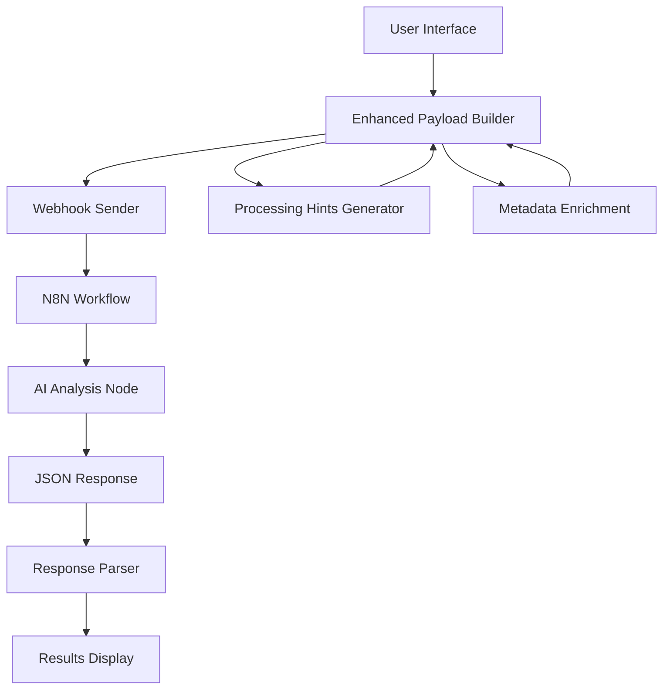

# Research Engine Architecture

The Research Engine is a comprehensive prospect analysis system that combines intelligent payload enhancement with AI-powered research through N8N workflows.

## System Overview



## Core Components

### 1. Frontend (React/TypeScript)
- Research initiation and results display
- Profile management (`lab_user_profiles`, `lab_company_profiles`)
- Credit system integration
- Dynamic JSONB response rendering

### 2. Enhanced Payload System
- Intelligent processing hints from profiles
- Context-aware metadata enrichment
- Comprehensive data package for AI

### 3. N8N Workflow
- Webhook receiver for enhanced payload
- AI processing with system prompt
- Structured JSON response

### 4. AI Analysis Engine
- **System Prompt Controlled**: All content structure defined in N8N
- **JSONB Storage**: Dynamic schema in `lab_prospect_research.research_results`
- **Auto-Adaptation**: UI renders any AI-generated sections automatically

### 5. Credit System
- **Default Allocation**: 5 credits per user (`lab_user_profiles.credits`)
- **Research Cost**: 1 credit per prospect research
- **Transaction Logging**: All changes logged in `lab_credit_transactions`
- **UI Integration**: Credit balance shown in dashboard and profile

## Data Flow

### 1. Research Initiation
```
Authentication Check (Supabase Auth)
↓
Credit Balance Check (lab_user_profiles.credits >= 1)
↓
Profile Validation (is_complete = true for both profiles)
↓
Deduct 1 Credit + Log Transaction (lab_credit_transactions)
↓
Generate Enhanced Payload (profiles + prospect data + hints)
↓
Send to N8N Webhook
```

### 2. N8N Processing
```
Enhanced Payload → Webhook → AI Analysis → Structured JSON Response
```

### 3. Response Storage & Display
```
JSON Response → Parse → Store (lab_prospect_research.research_results JSONB)
↓
Dynamic UI Rendering → Export Options
```

## Key Features

### Intelligent Payload Enhancement
- **Focus Areas**: Dynamic analysis prioritization
- **Communication Style**: Tone adaptation (professional/casual/consultative)
- **Experience Level**: Output complexity adjustment
- **Company Maturity**: Context-aware insights

### Dynamic Content Architecture
- **Master Control**: N8N system prompt defines all content structure
- **Flexible Sections**: AI generates any sections based on system prompt
- **Auto-Discovery**: Frontend automatically displays all generated sections
- **Future-Proof Design**: New sections appear automatically without code changes

### Adaptive Analysis Framework
- **System Prompt Driven**: All analysis structure controlled by N8N system prompt
- **JSONB Flexibility**: Dynamic storage accommodates any AI-generated structure
- **Zero Code Changes**: New sections automatically integrate into UI and exports
- **Content Evolution**: Analysis framework evolves through system prompt updates only

## Technology Stack

### Frontend
- React 18 + TypeScript
- Tailwind CSS with design system
- Shadcn/ui components
- React Router
- React Hook Form

### Backend
- **Supabase**: Database, Auth, RLS policies
- **N8N**: AI workflow orchestration
- **Webhooks**: Payload transmission

### AI Processing
- Claude/GPT-4 (N8N configured)
- System prompt controlled structure
- JSONB flexible schema

## Security

- **RLS Policies**: All `lab_*` tables enforce user-level access control
- **Authentication**: Supabase Auth with email verification
- **Webhook Secrets**: Stored in Supabase secrets, not environment variables
- **Input Validation**: Zod schemas validate all user inputs

## Database Tables

### User & Profiles
- `lab_user_profiles` - User details, credits, preferences (RLS: user_id)
- `lab_company_profiles` - Company info, offerings, differentiators (RLS: user_id)

### Research
- `lab_prospect_research` - Research records with JSONB results (RLS: user_id)
- `lab_credit_transactions` - Credit usage history (RLS: user_id)

### Templates
- `lab_research_templates` - Custom research templates (RLS: user_id)